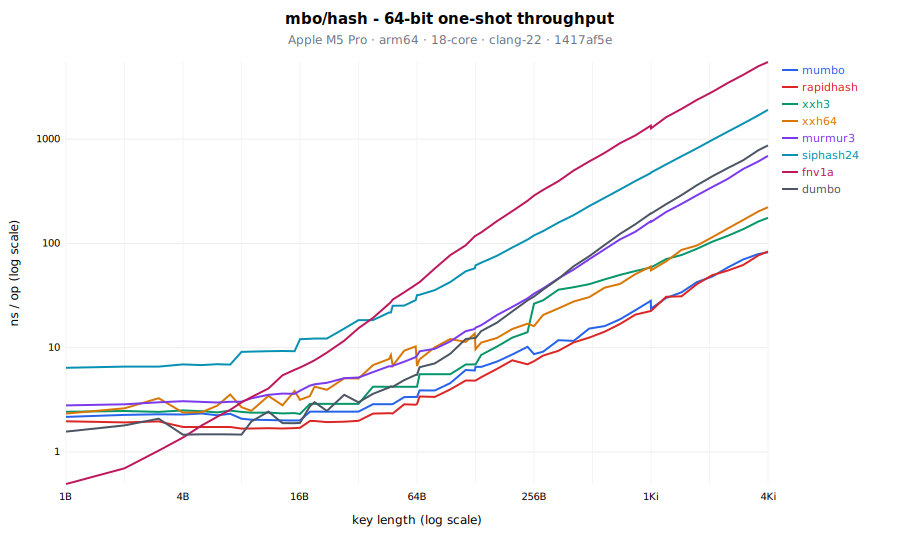
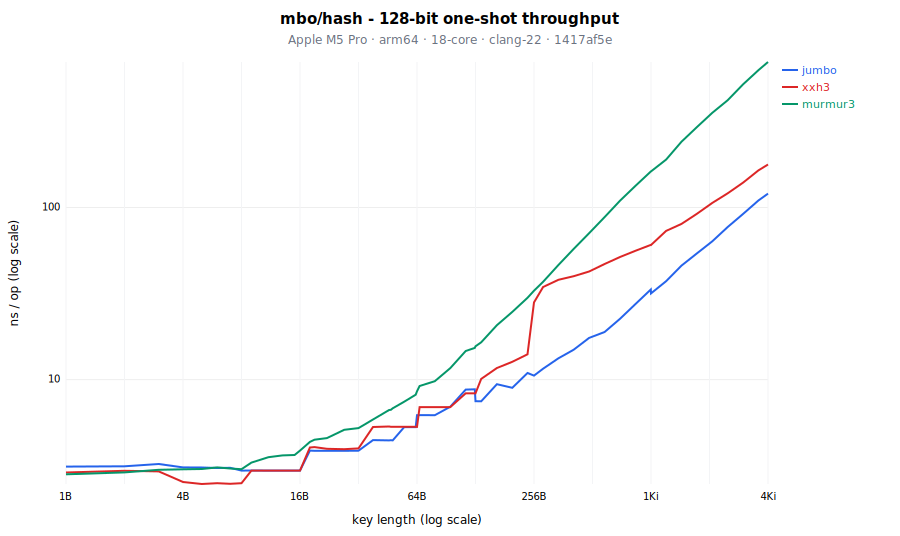
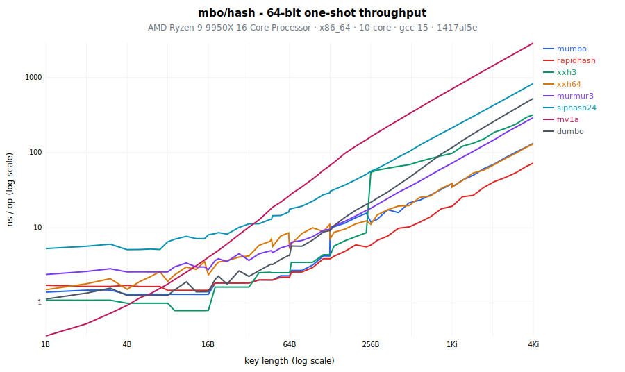
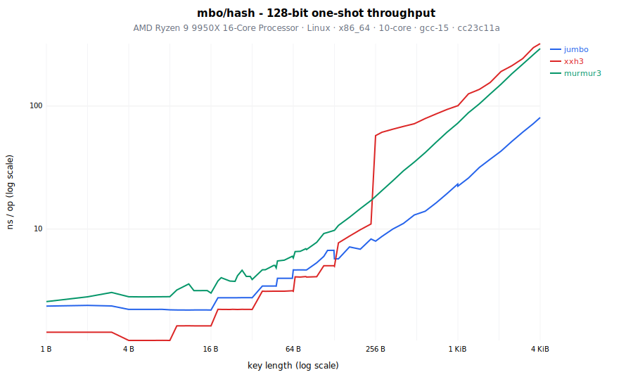

# mbo/hash - fast, constexpr-safe, non-cryptographic hashing

Fast, constexpr-safe, non-cryptographic hashing, built around the in-house
**mumbo/jumbo and dumbo** family: notice-free, pure Apache-2.0, and MUM-based
(widening multiply). All three pass [SMHasher3](https://gitlab.com/fwojcik/smhasher3)
clean (188/188): `mumbo` (64-bit) and its native 128-bit sibling `jumbo` (the
only clean native 128 we measured) post the best mixed-length latency in our
benchmarks, and `dumbo` is a compact single-lane companion with a very different
profile - fastest here on tiny keys, slower on bulk - that trades reach for size,
not quality.

It also ships a **build-seed mangle** (`hash_mangle.h`): restricted/limited,
constexpr-safe compile-time hash mangling with release-time rotation enforcement.
That is hash randomization for the constexpr world, which compile-time hashing
otherwise rules out.

The third-party algorithms (rapidhash, xxh3/xxh64, murmur3, siphash, fnv1a) are
exact transcriptions, kept for interop and comparison. Algorithm reference and
API listing: see the [repository README](../../README.md). Last but not least we
provide quality (SMHasher3) and performance measurements for all algorithms below.

## Offerings

Three entry points, split by contract:

- **`hash.h` / `:hash_cc` - deterministic hashing.** `GetHash64` /
  `GetHash128` / `GetHash32<Algo>`, the `Hasher<Algo>` container functor, and
  `Streamer<Algo>` incremental hashing - all constexpr-safe and fully
  reproducible for a given library version. Use for hash tables (heterogeneous
  string lookup), tokenization/interning, compile-time hashing
  (`static_assert`, switch-on-hash), and cross-process consistency within one
  build. Values are not a persistence or wire format.
- **`hash_mangle.h` / `:hash_mangle_cc` - deliberately unstable hashing.**
  `GetHash` / `MangledHasher<Algo>`: `GetHash64` XORed with one build-selected
  constant, so values do not compare across independently configured builds.
  Use when hash values must not quietly become load-bearing (persisted tables,
  golden values, cross-build protocols) - the instability is the feature.
  Still constexpr; semantics and design rationale in the build-seed mangle
  section, the flags in the Configuration section below.
- **`hash_extra.h` / `:hash_extra_cc` - NOTICE-bearing algorithms.** Canonical
  rapidhash, xxh3, and xxh64 transcriptions, for interop with externally
  defined values and for comparison. Shipping a binary that links this target
  requires shipping the repository-root [NOTICE](../../NOTICE).

## Principles

- **Canonical or honest**: third-party algorithms (rapidhash, XXH64/XXH3,
  MurmurHash3, SipHash, FNV-1a) are transcriptions producing the exact
  published reference values on every platform, pinned by reference vectors
  and differential tests against the reference libraries. The in-house `mumbo`
  algorithm is documented with its measured quality and performance data
  (below) and its design iterations.
- **constexpr-safe single path**: compile-time and run-time evaluation always
  agree; streaming (where provided) equals the one-shot value by contract.
- **Apache-2.0 with clean attribution**: transcription notices live in the
  repository-root [NOTICE](../../NOTICE); [LICENSE](../../LICENSE) stays pure
  Apache-2.0. No crypto-library
  dependencies - digests and hashes are spec-frozen pure functions that we
  verify against official vectors instead of trusting an unverifiable supply
  chain (see [mbo/digest/README.md](../digest/README.md) for the full argument).
- **Non-cryptographic hash-table hashes, with one keyed exception**: the
  defaults and comparison algorithms are fast hashes for hash tables and
  interning - their values are neither stable across versions nor safe against
  adversaries. `siphash` is the deliberate exception, a keyed PRF included as
  the hash-flooding-resistant choice when the seed is a secret; it is still a
  hash-table hash (`GetHash64` / `Hasher`), not a message digest. Cryptographic
  **message digests** and MACs (SHA-2/3, MD5 interop, BLAKE2/3, HMAC) are a
  different contract and live in [mbo/digest](../digest/README.md).

## Algorithm overview

This is the at-a-glance map; the `SMHasher3` column is a PASS/FAIL summary only.
For the exact score and the failing families see [Quality: SMHasher3](#quality-smhasher3).

<!-- BEGIN algorithm overview (generated by `hash_benchmark_report.py quality`; DO NOT EDIT) -->

| Algorithm   | Bits | Available via                     | Starlark | NOTICE                  | Seeded | Streaming | SMHasher3 |
| ----------- | ---: | --------------------------------- | -------- | ----------------------- | ------ | --------- | --------- |
| `mumbo`     |   64 | `hash.h` (default 64/32)          | no       | none (in-house)         | yes    | yes       | PASS      |
| `jumbo`     |  128 | `hash.h` (default 128)            | no       | none (in-house)         | yes    | yes (64)  | PASS      |
| `murmur3`   |  128 | `hash.h`                          | no       | none (public domain)    | yes    | no        | FAIL      |
| `siphash`   |   64 | `hash.h`                          | no       | none (CC0)              | keyed  | yes       | PASS      |
| `fnv1a`     |   64 | `hash.h`                          | yes      | none (public domain)    | yes    | no        | FAIL      |
| `dumbo`     |   64 | `hash.h`                          | yes      | none (in-house)         | yes    | no        | PASS      |
| `rapidhash` |   64 | `hash_extra.h` + `:hash_extra_cc` | no       | **MIT - ship NOTICE**   | yes    | no        | PASS      |
| `xxh64`     |   64 | `hash_extra.h` + `:hash_extra_cc` | no       | **BSD-2 - ship NOTICE** | yes    | yes       | FAIL      |
| `xxh3`      |   64 | `hash_extra.h` + `:hash_extra_cc` | no       | **BSD-2 - ship NOTICE** | yes    | no        | FAIL      |
| `xxh3`      |  128 | `hash_extra.h` + `:hash_extra_cc` | no       | **BSD-2 - ship NOTICE** | yes    | no        | FAIL      |

<!-- END algorithm overview -->

Notes: the **Starlark** column marks the hashes also implemented at build time
in [`hash.bzl`](hash.bzl) (`hash.dumbo` and `hash.fnv1a`), kept byte-for-byte
identical to the C++ prime and verified against it (`hash_tool`); mumbo and
jumbo stay C++-only. `fnv1a` is the algorithm family many `std::hash`
implementations use (e.g. MSVC) - included as the familiar baseline. `siphash`
is a keyed PRF: the DoS-resistant choice when the seed is a secret. `dumbo` is
the compact single-lane member of the MUM family: the fastest hash here for tiny
keys and SMHasher3-clean (see the design iterations), but single-lane (so it
slows on large keys) - a deliberately minimal companion to `mumbo`, not a
replacement for it. Linking `:hash_extra_cc` requires shipping the
repository-root [NOTICE](../../NOTICE) (see "Third-party components" in the
[repository README](../../README.md)).

## Build-seed mangle (`hash_mangle.h` / `:hash_mangle_cc`)

`mbo::hash::GetHash` and `MangledHasher<Algo>` equal `GetHash64` XORed with
ONE build-selected constant, so values deliberately do not compare across
independently configured builds - precomputed tables or persisted values
cannot silently become load-bearing. Everything stays constexpr: the constant
is generated into a header by folding the module's own version (from
`MODULE.bazel` via `native.module_version()` - no duplicated version
declaration anywhere) with two custom Bazel flags (see the
Configuration section below). Folding the version in means every release
rotates the constant by construction - at zero marginal cost, since a release
recompiles all dependents anyway - so "values are not stable across library
versions" holds by construction even under default flags.

Neither the version nor the raw seed string ever reaches a C++ action key:
both fold to a bucket inside the header-generation rule, so build/remote
caches see at most `N + 1` header variants and converge no matter how often
the seed rotates (per user, per release, or never - a `.bazelrc` one-liner
either way). Only targets depending on `:hash_mangle_cc` rebuild on rotation;
`hash.h` / `:hash_cc` users are never touched. One constant applies per
program: linking objects compiled under different flag values is an ODR
violation (within a single Bazel build consistency is structural).

### Design: constexpr rules out ASLR, buckets bound the churn

The mangle wants ASLR-style entropy - values that shift outside anyone's
control, so nothing can quietly start depending on them. Three constraints
shape the implementation:

1. **constexpr is non-negotiable, which rules out runtime entropy.** Every
   entry point participates in constant evaluation, including `GetHash`. True
   ASLR (absl-style: mixing in the address of a global) or any startup-time
   random seed cannot appear in a constant expression - adopting one would
   split the API into a constexpr unmangled half and a runtime mangled half.
   The entropy must be a compile-time constant, so it can only be injected at
   build time.

2. **Build-time entropy must not defeat caching.** A naive build-time seed
   (hashing `__DATE__`/`__TIME__`, as an earlier iteration did) takes a new
   value on every compile: every rotation is a cold miss for build and remote
   caches, and per-TU evaluation can even hand two translation units of one
   binary different constants (an ODR violation). Both problems stem from
   unbounded seed values entering the compiler's inputs.

3. **Churn must be bounded and adjustable.** Hence the two-flag design: the
   library version and the seed string are folded to one of `N` buckets
   inside the header-generation rule, and only the resulting constant reaches
   C++ action keys - a raw value (version, user name, date) never does.
   Caches therefore hold at most `N + 1`
   variants of the mangle-dependent build graph (objects, links, cached test
   results), no matter what rotates through the seed flag.
   `--//mbo/hash:mangle_seed_buckets` is the dial between entropy and cache
   footprint: `0` is reproducible (no entropy, no churn), `1` is one pinned
   constant (distinct from `GetHash64`, zero churn), larger `N` buys more
   variation at proportional cache cost. The `:hash_cc` / `:hash_mangle_cc`
   target split completes the containment: plain hash users sit entirely
   outside the churn.

### The fold is the in-house `dumbo` hash, ported to Starlark

The version-and-seed fold uses the in-house `dumbo` hash (SMHasher3-proven -
`fnv1a` is not), implemented in Starlark in `hash.bzl` so the build-time fold
and the shipped library agree on the algorithm. C++ is the prime
implementation; the Starlark port is kept byte-for-byte identical to it,
verified by `//mbo/hash:hash_bzl_vs_cpp_dumbo_test` (the bzl output diffed
against the `hash_tool` C++ binary). `dumbo` is the only in-house hash available
in Starlark - mumbo and jumbo stay C++-only - and the standard `fnv1a` is
offered there as well, likewise verified against C++.

Call the ports from your own rules via `@helly25_mbo//mbo/hash:hash.bzl` (at load
time; input is a printable-ASCII string or a list of byte values `0..255`, plus
an optional seed; returns the 64-bit hash as an `int`):

```starlark
load("@helly25_mbo//mbo/hash:hash.bzl", "hash")

_key = hash.dumbo("my build-time key")  # dumbo, seed 0
_fnv = hash.fnv1a([0x61, 0x62, 0x63])   # fnv1a, seed = FNV offset basis
```

## Configuration

All configuration lives on the mangle - the deterministic `hash.h` and
`hash_extra.h` entry points have no knobs. Set the flags on the command line
or in `.bazelrc`; prefix them with `@helly25_mbo` when the library is
consumed as a dependency (e.g. `--@helly25_mbo//mbo/hash:mangle_seed=...`).

- `--//mbo/hash:mangle_seed` (string, default `""`): any printable-ASCII
  string - user name, release tag, date - folded together with the library
  version to select the mangle constant.
- `--//mbo/hash:mangle_seed_buckets` (int, default `8`): the entropy/cache
  dial. `0` disables the mangle (`GetHash == GetHash64`, fully reproducible
  builds); `1` pins one stable constant across releases and seeds (`GetHash`
  stays distinct from `GetHash64`, zero churn); `N >= 2` bounds the variation
  to `N` constants at proportional cache footprint.

Example `.bazelrc` policies:

```sh
# Reproducible builds / golden tests: disable the mangle entirely.
build --//mbo/hash:mangle_seed_buckets=0

# Per-user variation on top of the per-release rotation.
build --//mbo/hash:mangle_seed=alice
```

Under default flags the constant still rotates once per release (the library
version is folded in). The header is generated per build and never committed,
so nothing can drift out of sync and a version bump needs no manual step. A
build that lacks the generated header is a hard error, not a silent fallback;
for clangd (which has no generated header) `hash_mangle.h` uses a stable
fallback constant under `-DIS_CLANGD` purely so the editor can parse it.

## Abseil interop

The two frameworks compose rather than compete - pick by contract:
`absl::Hash` is per-process randomized and tuned for tiny in-process keys;
`mbo::hash` is canonical, cross-platform, constexpr, and streamable.

- **Containers**: `DefaultHasher` (any `Hasher<Algo>` / `MangledHasher<Algo>`)
  drops into `absl`/`std` hash containers as the `Hash` parameter for string
  keys, with heterogeneous `string_view` lookup - this replaces absl's native
  hashing for byte keys outright.
- **Injecting mbo values into absl combining**: compute the mbo hash - via
  `Streamer` for chunked content - and combine the resulting integer like any
  other field. In-repo precedent: `Hash128` and `mbo::types::tstring` do
  exactly this.

  ```cpp
  template<typename H>
  friend H AbslHashValue(H state, const Document& doc) {
    mbo::hash::Streamer<mbo::hash::DefaultHashAlgorithm> stream;
    for (std::string_view chunk : doc.chunks) {
      stream.Update(chunk);
    }
    return H::combine(std::move(state), stream.Finalize(), doc.id);
  }
  ```

  The mbo value itself stays deterministic; the surrounding absl hash remains
  per-process seeded (which is what a container wants). Use the mangled
  `GetHash` instead of `GetHash64` where the injected value itself must not be
  comparable across builds.

- **The other direction needs care**: folding `absl::HashOf(x)` into mbo
  values (e.g. via `CombineHashes`) imports absl's per-process randomization -
  the result is no longer stable across runs, let alone builds. Only do this
  for values that never leave the process.
- **Replacing `absl::Hash` for arbitrary types**: possible by design but a
  deliberate project, not a flag. `AbslHashValue` is framework-agnostic: any
  hash state implementing `combine` / `combine_contiguous` (plus unordered
  support) can execute every existing `AbslHashValue` overload, so a
  mumbo-backed state could swap the algorithm underneath all absl-hashable
  types. Worth it only when structured types need canonical or constexpr
  hashing; for byte keys the container functor above already does the job.

## Performance

Measured with the tooling in [`mbo/hash/measurements/`](measurements/README.md)
(`-c opt`). Each block below is one machine and compiler, generated from a
committed data bundle. Numbers are the mean of the 3 fastest of 9 runs (with
interleaving and warmup): on a shared machine the fastest runs are the least
contended, and averaging a few is steadier than the median at these
sub-nanosecond sizes. Bold marks the fastest per row; the tables use a curated
set of lengths (straddling the dispatch-tier and SSO boundaries), the log-log
charts a denser one.

Everything between the markers is generated per machine by `publish` from the
committed bundles - regenerate it, don't hand-edit:

<!-- BEGIN mbo/hash benchmark results (generated by `hash_benchmark_report.py publish`; DO NOT EDIT) -->
<!-- bundles: mbo/hash/measurements/data/macos-arm64-apple-m5-pro_18c_clang-22_1417af5e_20260711_211526.tgz mbo/hash/measurements/data/linux-x86-64-amd-ryzen-9-9950x-16-core-processor_10c_gcc-15_1417af5e_20260711_203603.tgz -->

### Apple M5 Pro · arm64 · 18-core · clang-22 · 1417af5e




<!-- Apple M5 Pro · arm64 · 18-core · clang-22 · 1417af5e; mean of the 3 fastest of 9 reps -->

#### 64-bit one-shot throughput (ns/op, mean of the 3 fastest of 9 reps; lower is better)

| Length | mumbo     | rapidhash | xxh3  | xxh64 | murmur3 | siphash24 | fnv1a    | dumbo    |
| -----: | --------- | --------- | ----- | ----- | ------- | --------- | -------- | -------- |
|     1B | 2.17      | 1.97      | 2.43  | 2.34  | 2.80    | 6.43      | **0.49** | 1.57     |
|     3B | 2.30      | 1.96      | 2.42  | 3.28  | 3.00    | 6.60      | **1.03** | 2.09     |
|     5B | 2.34      | 1.74      | 2.46  | 2.41  | 3.02    | 6.82      | 1.80     | **1.48** |
|     7B | 2.32      | 1.74      | 2.50  | 3.56  | 3.03    | 6.90      | 2.54     | **1.48** |
|     8B | 2.09      | 1.68      | 2.42  | 2.69  | 3.04    | 9.13      | 2.99     | **1.47** |
|    11B | 2.03      | **1.69**  | 2.39  | 3.46  | 3.54    | 9.27      | 4.07     | 2.44     |
|    15B | 2.00      | **1.70**  | 2.36  | 3.85  | 3.62    | 9.26      | 6.14     | 1.89     |
|    16B | 2.01      | **1.71**  | 2.31  | 3.17  | 3.87    | 12.08     | 6.46     | 1.90     |
|    19B | 2.44      | **1.98**  | 2.89  | 4.24  | 4.46    | 12.26     | 7.59     | 3.00     |
|    22B | 2.44      | **1.94**  | 2.89  | 3.95  | 4.61    | 12.26     | 8.99     | 2.48     |
|    27B | 2.44      | **1.95**  | 2.89  | 5.09  | 5.10    | 15.27     | 11.69    | 3.54     |
|    32B | 2.44      | **1.99**  | 2.89  | 5.07  | 5.18    | 18.43     | 15.39    | 3.00     |
|    38B | 2.88      | **2.34**  | 4.23  | 6.82  | 5.84    | 18.41     | 19.35    | 3.62     |
|    47B | 2.87      | **2.35**  | 4.22  | 8.52  | 6.60    | 21.79     | 27.44    | 4.26     |
|    48B | 2.88      | **2.34**  | 4.23  | 6.72  | 6.72    | 25.24     | 28.93    | 4.22     |
|    63B | 3.37      | **2.84**  | 4.22  | 10.31 | 8.14    | 28.67     | 40.26    | 5.49     |
|    64B | 3.37      | **2.89**  | 4.23  | 6.68  | 8.40    | 31.95     | 41.07    | 5.49     |
|   127B | 6.04      | **4.85**  | 6.92  | 13.70 | 15.14   | 57.83     | 117.3    | 12.41    |
|   128B | 6.55      | **4.84**  | 6.91  | 9.66  | 15.55   | 61.64     | 118.4    | 12.38    |
|   256B | 8.69      | **7.44**  | 26.46 | 16.12 | 32.96   | 119.5     | 287.7    | 31.00    |
|    1Ki | 23.73     | **22.50** | 58.92 | 55.30 | 161.1   | 479.9     | 1271     | 193.5    |
|    4Ki | **82.37** | 83.87     | 176.3 | 222.9 | 692.6   | 1915      | 5503     | 871.8    |

#### 128-bit one-shot throughput (ns/op, mean of the 3 fastest of 9 reps; native-128 algorithms only)

| Length | jumbo     | xxh3     | murmur3  |
| -----: | --------- | -------- | -------- |
|     1B | 3.12      | 2.88     | **2.81** |
|     3B | 3.23      | **2.92** | 2.99     |
|     5B | 3.08      | **2.47** | 3.02     |
|     7B | 3.07      | **2.48** | 3.04     |
|     8B | 2.96      | **2.50** | 3.01     |
|    11B | 2.96      | **2.96** | 3.54     |
|    15B | **2.96**  | 2.96     | 3.64     |
|    16B | **2.96**  | 2.96     | 3.86     |
|    19B | **3.86**  | 4.05     | 4.47     |
|    22B | **3.86**  | 3.96     | 4.57     |
|    27B | **3.86**  | 3.94     | 5.11     |
|    32B | **3.86**  | 3.98     | 5.23     |
|    38B | **4.45**  | 5.30     | 5.86     |
|    47B | **4.44**  | 5.31     | 6.68     |
|    48B | **4.43**  | 5.31     | 6.81     |
|    63B | **5.29**  | 5.31     | 8.17     |
|    64B | 6.21      | **5.31** | 8.55     |
|   127B | 8.77      | **8.33** | 15.27    |
|   128B | **7.48**  | 8.32     | 15.61    |
|   256B | **10.55** | 28.10    | 32.83    |
|    1Ki | **31.69** | 60.54    | 162.2    |
|    4Ki | **120.4** | 177.7    | 700.6    |

#### Mixed-length latency (ns/hash, mean of the 3 fastest of 9 reps; lower is better)

| max len | mumbo     | rapidhash | xxh3  | xxh64 | murmur3 | siphash24 | fnv1a | dumbo |
| ------: | --------- | --------- | ----- | ----- | ------- | --------- | ----- | ----- |
|      16 | **9.88**  | 10.68     | 11.52 | 13.98 | 15.48   | 18.99     | 14.70 | 12.67 |
|      64 | **12.37** | 12.64     | 12.74 | 20.78 | 20.82   | 29.22     | 35.14 | 18.82 |
|    1024 | 27.81     | **27.55** | 37.07 | 66.34 | 69.60   | 231.0     | 604.0 | 99.15 |

### AMD Ryzen 9 9950X 16-Core Processor · x86_64 · 10-core · gcc-15 · 1417af5e




<!-- AMD Ryzen 9 9950X 16-Core Processor · x86_64 · 10-core · gcc-15 · 1417af5e; mean of the 3 fastest of 9 reps -->

#### 64-bit one-shot throughput (ns/op, mean of the 3 fastest of 9 reps; lower is better)

| Length | mumbo    | rapidhash | xxh3     | xxh64 | murmur3 | siphash24 | fnv1a    | dumbo |
| -----: | -------- | --------- | -------- | ----- | ------- | --------- | -------- | ----- |
|     1B | 1.39     | 1.71      | 1.09     | 1.50  | 2.39    | 5.29      | **0.36** | 1.12  |
|     3B | 1.48     | 1.65      | 1.09     | 2.10  | 2.85    | 6.05      | **0.73** | 1.57  |
|     5B | 1.30     | 1.65      | **0.99** | 1.93  | 2.58    | 5.13      | 1.17     | 1.26  |
|     7B | 1.30     | 1.65      | **0.99** | 2.60  | 2.58    | 5.13      | 1.56     | 1.26  |
|     8B | 1.30     | 1.47      | **0.99** | 1.94  | 2.58    | 6.51      | 1.78     | 1.26  |
|    11B | 1.30     | 1.47      | **0.79** | 3.01  | 3.40    | 7.70      | 2.56     | 1.90  |
|    15B | 1.30     | 1.47      | **0.79** | 3.55  | 3.00    | 7.17      | 3.73     | 1.40  |
|    16B | 1.30     | 1.47      | **0.79** | 2.36  | 2.77    | 8.04      | 4.04     | 1.40  |
|    19B | 1.84     | 1.84      | **1.62** | 3.49  | 3.87    | 8.64      | 4.99     | 2.27  |
|    22B | 1.84     | 1.84      | **1.62** | 3.65  | 3.55    | 8.23      | 6.07     | 1.78  |
|    27B | 1.83     | 1.84      | **1.62** | 4.07  | 4.51    | 10.10     | 8.12     | 2.66  |
|    32B | 1.84     | 1.84      | **1.62** | 4.22  | 3.68    | 11.26     | 10.21    | 2.25  |
|    38B | 2.02     | **2.02**  | 2.52     | 5.82  | 4.50    | 11.31     | 12.75    | 2.68  |
|    47B | **2.02** | 2.02      | 2.52     | 7.09  | 4.94    | 12.93     | 18.11    | 3.28  |
|    48B | 2.02     | **2.02**  | 2.52     | 5.65  | 4.67    | 14.49     | 18.80    | 3.25  |
|    63B | 2.30     | **2.19**  | 2.52     | 8.55  | 5.79    | 16.20     | 26.28    | 4.28  |
|    64B | 2.29     | **2.19**  | 2.52     | 5.26  | 5.60    | 17.71     | 26.85    | 4.26  |
|   127B | 4.21     | **3.87**  | 4.37     | 11.15 | 9.54    | 29.13     | 67.24    | 9.18  |
|   128B | 10.26    | **3.86**  | 4.33     | 7.17  | 9.51    | 30.64     | 67.94    | 9.18  |
|   256B | 11.97    | **5.87**  | 54.80    | 11.15 | 18.20   | 56.54     | 163.5    | 21.82 |
|    1Ki | 34.99    | **19.31** | 98.09    | 34.90 | 72.59   | 214.2     | 709.8    | 117.0 |
|    4Ki | 133.6    | **72.78** | 319.8    | 130.8 | 294.2   | 835.5     | 2891     | 528.6 |

#### 128-bit one-shot throughput (ns/op, mean of the 3 fastest of 9 reps; native-128 algorithms only)

| Length | jumbo     | xxh3     | murmur3 |
| -----: | --------- | -------- | ------- |
|     1B | 2.38      | **1.46** | 2.60    |
|     3B | 2.38      | **1.46** | 3.07    |
|     5B | 2.23      | **1.25** | 2.84    |
|     7B | 2.23      | **1.26** | 2.84    |
|     8B | 2.21      | **1.25** | 2.84    |
|    11B | 2.20      | **1.64** | 3.61    |
|    15B | 2.21      | **1.65** | 3.19    |
|    16B | 2.21      | **1.65** | 3.04    |
|    19B | 2.78      | **2.24** | 4.06    |
|    22B | 2.78      | **2.24** | 3.80    |
|    27B | 2.78      | **2.24** | 4.66    |
|    32B | 2.78      | **2.24** | 3.91    |
|    38B | 3.46      | **3.15** | 4.70    |
|    47B | 3.46      | **3.15** | 5.10    |
|    48B | 3.46      | **3.15** | 4.87    |
|    63B | 4.00      | **3.14** | 6.06    |
|    64B | 4.68      | **3.14** | 5.86    |
|   127B | 6.74      | **5.06** | 9.80    |
|   128B | 5.76      | **5.02** | 9.81    |
|   256B | **8.01**  | 57.73    | 18.48   |
|    1Ki | **22.50** | 100.8    | 72.88   |
|    4Ki | **81.15** | 322.9    | 294.0   |

#### Mixed-length latency (ns/hash, mean of the 3 fastest of 9 reps; lower is better)

| max len | mumbo | rapidhash | xxh3  | xxh64 | murmur3 | siphash24 | fnv1a    | dumbo |
| ------: | ----- | --------- | ----- | ----- | ------- | --------- | -------- | ----- |
|      16 | 4.29  | **4.12**  | 4.29  | 7.18  | 6.68    | 8.48      | 6.88     | 5.78  |
|      64 | 5.21  | 5.49      | 1.57  | 13.48 | 8.23    | 11.86     | **0.27** | 8.22  |
|    1024 | 22.29 | **9.93**  | 49.64 | 39.52 | 44.07   | 112.2     | 331.3    | 59.00 |

<!-- END mbo/hash benchmark results -->

Reading the tables (exact numbers are per machine above; the pattern holds across
arm64/clang and x86_64/gcc): `mumbo` and `rapidhash` are close on small keys.
`mumbo` gives up a little on 17-64 byte keys - the cost of the extra finalizer
that gets it a clean SMHasher3 pass - but wins the mixed-length latency test,
which is closer to how a hash table actually uses a hash. For 128-bit output,
`jumbo` is fastest from the mid sizes up. `fnv1a` is quickest on 1-3 byte keys,
`dumbo` does well on tiny keys but falls off on large ones, and `siphash` is
slower throughout - the price of being a keyed PRF (Pseudo-Random Function, see
[SipHash: a fast short-input PRF](https://cr.yp.to/siphash/siphash-20120918.pdf)).

## Quality: SMHasher3

[SMHasher3](https://gitlab.com/fwojcik/smhasher3) is the research-grade hash
test battery; passing it is the community bar for a production-quality
general-purpose hash. All results below are **our own measurements on one
rig** (same build, container, flags, and machine - see Methodology), so the
numbers are directly comparable.

### Results

<!-- BEGIN SMHasher3 results (generated by `hash_benchmark_report.py quality`; DO NOT EDIT) -->

| Algorithm   | Bits | Role in mbo/hash          | SMHasher3 result | Failures                                                                                                                                                                                                |
| ----------- | ---: | ------------------------- | ---------------- | ------------------------------------------------------------------------------------------------------------------------------------------------------------------------------------------------------- |
| `dumbo`     |   64 | `hash.h` (compact MUM)    | PASS             | none                                                                                                                                                                                                    |
| `fnv1a`     |   64 | `hash.h`                  | 7/186            | nearly every family: Avalanche, BIC, Sparse, Cyclic, Permutation, Text, TwoBytes, Bitflip, PerlinNoise, and the complete Seed* cluster                                                                  |
| `mumbo`     |   64 | default (64/32/streaming) | PASS             | none                                                                                                                                                                                                    |
| `rapidhash` |   64 | extra (`hash_extra_cc`)   | PASS             | none                                                                                                                                                                                                    |
| `siphash`   |   64 | `hash.h` (keyed PRF)      | PASS             | none                                                                                                                                                                                                    |
| `xxh3`      |   64 | extra (`hash_extra_cc`)   | 166/188          | BIC [3, 8, 11], Sparse [20/3], PerlinNoise [2], Bitflip [8], SeedZeroes [1280, 8448], SeedSparse [2, 3], SeedBlockLen [8, 13, 14, 15, 16], SeedBlockOffset [0, 1, 2, 3, 4], SeedBIC [3, 8]              |
| `xxh64`     |   64 | extra (`hash_extra_cc`)   | 181/188          | SeedBlockLen [15, 19, 21, 26, 29, 30], SeedBIC [8]                                                                                                                                                      |
| `jumbo`     |  128 | default (128)             | PASS             | none                                                                                                                                                                                                    |
| `murmur3`   |  128 | `hash.h`                  | 123/188          | BIC, Zeroes, Permutation, and the complete Seed* cluster (11 families)                                                                                                                                  |
| `xxh3`      |  128 | extra (`hash_extra_cc`)   | 162/188          | BIC [3, 8, 15], Sparse [20/3], PerlinNoise [2], Bitflip [3, 4, 8], SeedZeroes [1280, 8448], SeedSparse [2, 3], SeedBlockLen [8, 12, 13, 14, 15, 16], SeedBlockOffset [0, 1, 2, 3, 4, 5], SeedBIC [3, 8] |

<!-- END SMHasher3 results -->

The `SMHasher3 result` column shows `PASS` when every test passes, otherwise the failing `passed/total` count (e.g. `7/186`).

Reading the results:

- SMHasher3 is substantially stricter than the original SMHasher: `xxh64` and
  `xxh3` pass the original battery, and most of their failures above are in
  the newer `Seed*` families (weak seed handling), which the original battery
  does not probe.
- `mumbo`, `rapidhash`, and `dumbo` are the clean 64-bit passes (two of the
  three in-house); `jumbo` (the mumbo family's native 128, "mumbo jumbo") is
  the only clean 128-bit result we have measured on this rig - every other
  tested 128-bit variant fails more of the battery than its 64-bit sibling,
  because the wider output gives the statistics more surface to catch bias and
  lane correlation on.
- Of the classics: `siphash` (a keyed PRF) is clean, as security designs must
  be; `murmur3` (2011) fails the modern battery broadly; and `fnv1a` - the
  algorithm family behind many `std::hash` implementations - passes 7 of 186
  tests. Numbers worth remembering when defaulting to `std::hash`.
- The mumbo/jumbo family is the default in all forms; the extras remain
  available for
  canonical-value interop via `hash_extra.h` (`//mbo/hash:hash_extra_cc`,
  which carries the third-party NOTICE obligations - see the repository-root
  NOTICE).

### mumbo: the measured design iterations

Lineage first: the library's original hash was `dumbo` (originally named
`simple`; the legacy pre-0.13 `GetHash`, still shipped as `mbo::hash::dumbo`
and since redesigned into a compact MUM hash - its own iterations are below).
Its
intended replacement `mh` (never released) accumulated hardening rounds -
sparse-key collision fixes, seed hardening - but its SMHasher3 failure list
never fully cleared, and rapidhash held the default in the interim. The
lessons from that failure analysis fed a clean-sheet widening-multiply (MUM)
redesign under the working name `mh2`, which is where the measured iterations
below begin (v1-v3). On reaching 188/188 in both widths it was renamed
`mumbo` (MUM + mbo), `mh` was dropped entirely, and mumbo/jumbo took the
defaults; v4 landed with that rename.

`mumbo` reached the clean pass in four measured iterations (each step:
benchmark plus both SMHasher3 batteries):

1. v1 (175/188): MUM core with unrolled small-key loads. All failures in
   sparse/short-key families - the finalizer folded the widening product
   early and then multiplied against a constant, leaking quasi-linear deltas.
2. v2 (177/188): the finalizer keeps BOTH product halves and mixes them
   against each other. Remaining failures: for <= 8-byte keys the data sat in
   only one product operand, so permuted keys correlate pairwise through the
   shared seed operand.
3. v3 (188/188 both widths): data loads into both product operands (products
   quadratic in the data), the length folded into the seed, distinct
   bulk-chain initializers.
4. v4 (re-verified PASS 188/188 in both widths): the length moved from the
   seed into
   the finalizer's product operands - equally protective, but known only at
   finalize, which is what makes streaming possible; the 128-bit lane seeds
   derive from secret pairs distinct from the 64-bit chain, so no lane ever
   equals the 64-bit hash. The table above reflects the latest completed
   batteries.

### dumbo: the measured design iterations

`dumbo` was rebuilt from the legacy hash the same measured way (each step:
both benchmarks plus the SMHasher3 battery). It stays deliberately minimal
next to `mumbo` - ONE 64-bit accumulator, ONE 8-byte word folded per step, no
small-key switch, no parallel lanes, no streaming, and no 128-bit form - so it
reads as the compact MUM hash rather than a second tuned one:

1. legacy (40/188): the original `simple` hash. Silly constants (multiply by
   `6571`, add `17`/`193`, a `104729` tail) and a multi-op per-4-byte step
   (two small multiplies, two shifts, an add, two XORs). Barely diffused - it
   failed nearly every family - and slow (the op soup, four bytes at a time).
2. v1 (132/188, ~2-3x faster than legacy): nothing-up-my-sleeve constants
   (golden ratio, sqrt-prime fractions) and a clean single step over 8-byte
   words - `hash = (hash ^ word) * kConst; hash ^= hash >> 29` - then `fmix64`.
   The gross failures cleared, but it caps here: a **constant** multiplier is
   linear, so the collision and distribution families stay red no matter how
   good the constant is. (It also exposed a length-fold bug: folding length at
   init let a single low input bit cancel a length delta -
   `(kInit+16)^4 == kInit+12` - colliding 1-bit keys with all-zero keys; the
   length now folds in at the end, after every bit is diffused.)
3. v2 (186/188): the step becomes the MUM primitive
   `Mul128Fold64(word ^ kWord, state ^ kState)` - the widening multiply with
   **both operands state/data dependent**, so the product is quadratic (mumbo's
   mixing, single-lane). That clears every avalanche, distribution, keyset and
   full-width collision family. The two residual failures are both in
   `SeedZeroes`: dumbo is single-lane, so for zero-data keys the seed (folded
   only at init) enters the finalizer weakly mixed and shows marginal low-bit
   collisions.
4. v3 (188/188, shipped): the finalizer becomes a two-multiply widening
   avalanche (keep BOTH halves of the first product, multiply them together)
   with the **seed injected directly into a product operand**, not only at
   init. That makes the output quadratic in the seed even for zero-data keys,
   clearing the last two `SeedZeroes` windows. A single fold measured against a
   seeded 8-lane merge is what lets mumbo pass with its finalizer; dumbo, being
   single-lane, needs the seed at finalize instead. Clean 188/188, and dumbo
   now has strong (not merely reactive) avalanche. Cost: the two widening
   multiplies are ~0.15-0.35 ns slower on tiny keys than v2's `fmix64`, still
   the fastest hash here at 7-8 B.

### Methodology (reproduction)

- SMHasher3 @ gitlab.com/fwojcik/smhasher3, commit `6ab4343` (2026-03-26),
  built with gcc 13 in a linux/arm64 container, `-march=armv8-a+crc` (two build fixes
  needed: a missing `<cstdlib>` include in `lib/AEStest.cpp`, and replacing
  `-march=native` in CMakeLists.txt, which emits SHA3 `eor3` instructions the
  container toolchain rejects).
- `rapidhash`, `XXH3-64`, `XXH-64`, `XXH3-128`, `FNV-1a-64`,
  `MurmurHash3-128`, and `SipHash-2-4` are SMHasher3's built-in
  registrations of the same reference algorithms our headers transcribe
  (transcriptions are vector- and differential-verified equal, so the results
  transfer; the built-in `XXH3-128` ran its NEON implementation on this rig,
  which produces the identical canonical values).
- The in-house `mumbo-64`/`jumbo-128` and `dumbo-64` are registered by
  `mbo/hash/measurements/smhasher3/mbohash.cpp`, which `#include`s the ACTUAL
  `mbo/hash` headers (so the real implementation is verified, not a
  transcription). `mbo/hash/measurements/build_smhasher3.sh` clones SMHasher3,
  applies the fixes above, installs the plugin + headers, and builds it (the
  plugin needs C++20). Reproduce all of it with that one script.
- Full default battery per hash: `./SMHasher3 <name>` (~12 minutes each).
  Full logs are not committed; regenerate as above. Last run (2026-07): all
  three in-house hashes clean - `mumbo-64`/`jumbo-128` and `dumbo-64` PASS
  188 / 188.
- To produce measurements on another machine (or refresh a machine's numbers),
  run the tooling from the repo root (full per-machine and publish steps in
  [`measurements/README.md`](measurements/README.md)):

  ```sh
  # On the new machine: one perf sweep + the SMHasher3 battery, packed into a
  # per-machine Git-LFS bundle whose path the script prints.
  mbo/hash/measurements/run_measurements.py --config clang --jobs 4
  git add mbo/hash/measurements/data/<bundle>.tgz
  git lfs push origin HEAD && git push

  # Re-render this README from the chosen bundles, then refresh the SMHasher3
  # Results table from the same bundle's measured data.
  mbo/hash/measurements/hash_benchmark_report.py publish --bundles data/<bundle>.tgz
  mbo/hash/measurements/hash_benchmark_report.py quality --smhasher data/<bundle>.tgz
  git add mbo/hash/README.md mbo/hash/measurements/charts
  ```
