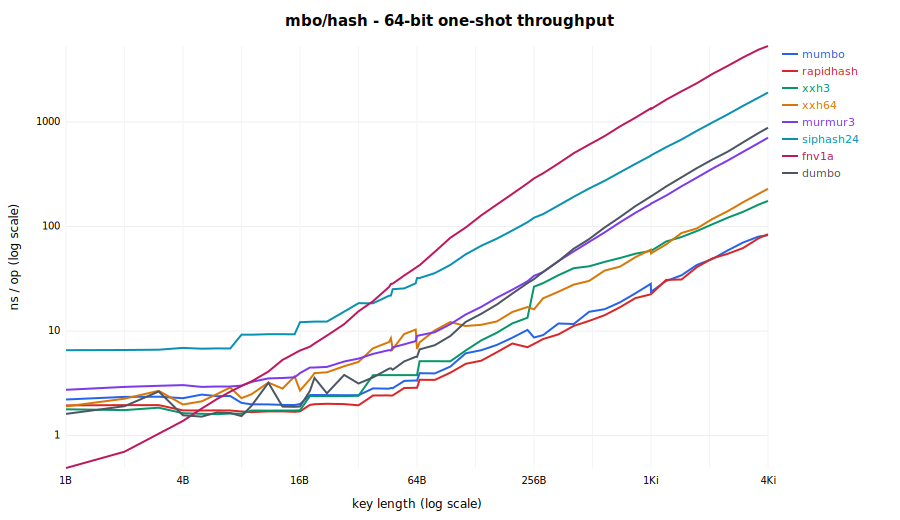
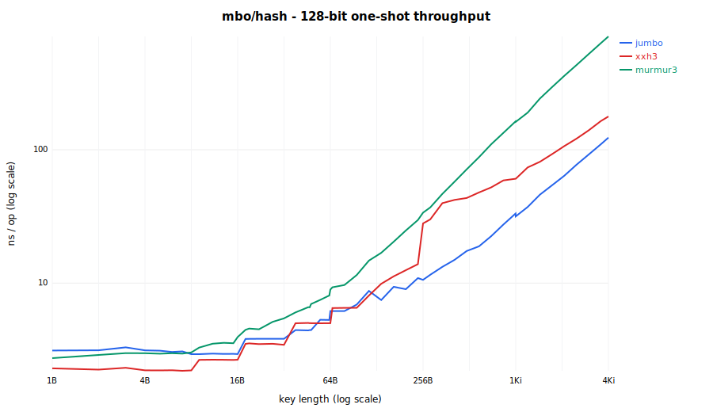

# mbo/hash - fast, constexpr-safe, non-cryptographic hashing

Spec-based, fast, constexpr-compatible, Apache-licensed, no-nonsense hash
implementations. Algorithm reference and API listing: see the
[repository README](../../README.md). Quality (SMHasher3) and performance
measurements for all algorithms: below.

## Offerings

Three entry points, split by contract:

- **`hash.h` / `:hash_cc` - deterministic hashing.** `GetHash64` /
  `GetHash128` / `GetHash32<Algo>`, the `Hasher<Algo>` container functor, and
  `Streamer<Algo>` incremental hashing - all constexpr-safe and fully
  reproducible for a given library version. Use for hash tables (heterogeneous
  string lookup), tokenization/interning, compile-time hashing
  (`static_assert`, switch-on-hash), and cross-process consistency within one
  build. Values are not a persistence or wire format.
- **`hash_mangle.h` / `:hash_mangle_cc` - deliberately unstable hashing.**
  `GetHash` / `MangledHasher<Algo>`: `GetHash64` XORed with one build-selected
  constant, so values do not compare across independently configured builds.
  Use when hash values must not quietly become load-bearing (persisted tables,
  golden values, cross-build protocols) - the instability is the feature.
  Still constexpr; semantics and design rationale in the build-seed mangle
  section, the flags in the Configuration section below.
- **`hash_extra.h` / `:hash_extra_cc` - NOTICE-bearing algorithms.** Canonical
  rapidhash, xxh3, and xxh64 transcriptions, for interop with externally
  defined values and for comparison. Shipping a binary that links this target
  requires shipping the repository-root [NOTICE](../../NOTICE).

## Principles

- **Canonical or honest**: third-party algorithms (rapidhash, XXH64/XXH3,
  MurmurHash3, SipHash, FNV-1a) are transcriptions producing the exact
  published reference values on every platform, pinned by reference vectors
  and differential tests against the reference libraries. The in-house `mumbo`
  algorithm is documented with its measured quality and performance data
  (below) and its design iterations.
- **constexpr-safe single path**: compile-time and run-time evaluation always
  agree; streaming (where provided) equals the one-shot value by contract.
- **Apache-2.0 with clean attribution**: transcription notices live in the
  repository-root [NOTICE](../../NOTICE); [LICENSE](../../LICENSE) stays pure
  Apache-2.0. No crypto-library
  dependencies - digests and hashes are spec-frozen pure functions that we
  verify against official vectors instead of trusting an unverifiable supply
  chain (see [mbo/digest/README.md](../digest/README.md) for the full argument).
- **Non-cryptographic hash-table hashes, with one keyed exception**: the
  defaults and comparison algorithms are fast hashes for hash tables and
  interning - their values are neither stable across versions nor safe against
  adversaries. `siphash` is the deliberate exception, a keyed PRF included as
  the hash-flooding-resistant choice when the seed is a secret; it is still a
  hash-table hash (`GetHash64` / `Hasher`), not a message digest. Cryptographic
  **message digests** and MACs (SHA-2/3, MD5 interop, BLAKE2/3, HMAC) are a
  different contract and live in [mbo/digest](../digest/README.md).

## Algorithm overview

| Algorithm   | Widths | Available via                     | NOTICE                  | Seeded | Streaming | SMHasher3      |
| ----------- | ------ | --------------------------------- | ----------------------- | ------ | --------- | -------------- |
| `mumbo`     | 64     | `hash.h` (default 64/32)          | none (in-house)         | yes    | yes       | PASS           |
| `jumbo`     | 128    | `hash.h` (default 128)            | none (in-house)         | yes    | yes (64)  | PASS           |
| `murmur3`   | 64/128 | `hash.h`                          | none (public domain)    | yes    | no        | FAIL (123)     |
| `siphash`   | 64     | `hash.h`                          | none (CC0)              | keyed  | yes       | PASS (186)     |
| `fnv1a`     | 64     | `hash.h`                          | none (public domain)    | yes    | no        | FAIL (7!)      |
| `dumbo`     | 64     | `hash.h`                          | none (in-house)         | yes    | no        | PASS           |
| `rapidhash` | 64     | `hash_extra.h` + `:hash_extra_cc` | **MIT - ship NOTICE**   | yes    | no        | PASS           |
| `xxh64`     | 64     | `hash_extra.h` + `:hash_extra_cc` | **BSD-2 - ship NOTICE** | yes    | yes       | FAIL (181)     |
| `xxh3`      | 64/128 | `hash_extra.h` + `:hash_extra_cc` | **BSD-2 - ship NOTICE** | yes    | no        | FAIL (166/162) |

Notes: `fnv1a` is the algorithm family many `std::hash` implementations use
(e.g. MSVC) - included as the familiar baseline. `siphash` is a keyed PRF:
the DoS-resistant choice when the seed is a secret. `dumbo` is the compact
single-lane member of the MUM family: the fastest hash here for tiny keys and
SMHasher3-clean (188/188, see the design iterations), but single-lane (so it
slows on large keys) - a deliberately minimal companion to `mumbo`, not a
replacement for it. Linking `:hash_extra_cc` requires
shipping the repository-root [NOTICE](../../NOTICE) (see "Third-party
components" in the [repository README](../../README.md)).

## Build-seed mangle (`hash_mangle.h` / `:hash_mangle_cc`)

`mbo::hash::GetHash` and `MangledHasher<Algo>` equal `GetHash64` XORed with
ONE build-selected constant, so values deliberately do not compare across
independently configured builds - precomputed tables or persisted values
cannot silently become load-bearing. Everything stays constexpr: the constant
is generated into a header by folding the module's own version (from
`MODULE.bazel` via `native.module_version()` - no duplicated version
declaration anywhere) with two custom Bazel flags (see the
Configuration section below). Folding the version in means every release
rotates the constant by construction - at zero marginal cost, since a release
recompiles all dependents anyway - so "values are not stable across library
versions" holds by construction even under default flags.

Neither the version nor the raw seed string ever reaches a C++ action key:
both fold to a bucket inside the header-generation rule, so build/remote
caches see at most `N + 1` header variants and converge no matter how often
the seed rotates (per user, per release, or never - a `.bazelrc` one-liner
either way). Only targets depending on `:hash_mangle_cc` rebuild on rotation;
`hash.h` / `:hash_cc` users are never touched. One constant applies per
program: linking objects compiled under different flag values is an ODR
violation (within a single Bazel build consistency is structural).

### Design: constexpr rules out ASLR, buckets bound the churn

The mangle wants ASLR-style entropy - values that shift outside anyone's
control, so nothing can quietly start depending on them. Three constraints
shape the implementation:

1. **constexpr is non-negotiable, which rules out runtime entropy.** Every
   entry point participates in constant evaluation, including `GetHash`. True
   ASLR (absl-style: mixing in the address of a global) or any startup-time
   random seed cannot appear in a constant expression - adopting one would
   split the API into a constexpr unmangled half and a runtime mangled half.
   The entropy must be a compile-time constant, so it can only be injected at
   build time.

2. **Build-time entropy must not defeat caching.** A naive build-time seed
   (hashing `__DATE__`/`__TIME__`, as an earlier iteration did) takes a new
   value on every compile: every rotation is a cold miss for build and remote
   caches, and per-TU evaluation can even hand two translation units of one
   binary different constants (an ODR violation). Both problems stem from
   unbounded seed values entering the compiler's inputs.

3. **Churn must be bounded and adjustable.** Hence the two-flag design: the
   library version and the seed string are folded to one of `N` buckets
   inside the header-generation rule, and only the resulting constant reaches
   C++ action keys - a raw value (version, user name, date) never does.
   Caches therefore hold at most `N + 1`
   variants of the mangle-dependent build graph (objects, links, cached test
   results), no matter what rotates through the seed flag.
   `--//mbo/hash:mangle_seed_buckets` is the dial between entropy and cache
   footprint: `0` is reproducible (no entropy, no churn), `1` is one pinned
   constant (distinct from `GetHash64`, zero churn), larger `N` buys more
   variation at proportional cache cost. The `:hash_cc` / `:hash_mangle_cc`
   target split completes the containment: plain hash users sit entirely
   outside the churn.

## Configuration

All configuration lives on the mangle - the deterministic `hash.h` and
`hash_extra.h` entry points have no knobs. Set the flags on the command line
or in `.bazelrc`; prefix them with `@helly25_mbo` when the library is
consumed as a dependency (e.g. `--@helly25_mbo//mbo/hash:mangle_seed=...`).

- `--//mbo/hash:mangle_seed` (string, default `""`): any printable-ASCII
  string - user name, release tag, date - folded together with the library
  version to select the mangle constant.
- `--//mbo/hash:mangle_seed_buckets` (int, default `8`): the entropy/cache
  dial. `0` disables the mangle (`GetHash == GetHash64`, fully reproducible
  builds); `1` pins one stable constant across releases and seeds (`GetHash`
  stays distinct from `GetHash64`, zero churn); `N >= 2` bounds the variation
  to `N` constants at proportional cache footprint.

Example `.bazelrc` policies:

```sh
# Reproducible builds / golden tests: disable the mangle entirely.
build --//mbo/hash:mangle_seed_buckets=0

# Per-user variation on top of the per-release rotation.
build --//mbo/hash:mangle_seed=alice
```

Under default flags the constant still rotates once per release (the library
version is folded in). Non-Bazel builds fall back to the checked-in
`internal/hash_mangle_seed.h.in`, which carries the default-flag constant for
the current version; `//mbo/hash:hash_mangle_seed_default_test` keeps it
byte-identical to the generated header, and a version bump regenerates it
(command in the file's header comment).

## Abseil interop

The two frameworks compose rather than compete - pick by contract:
`absl::Hash` is per-process randomized and tuned for tiny in-process keys;
`mbo::hash` is canonical, cross-platform, constexpr, and streamable.

- **Containers**: `DefaultHasher` (any `Hasher<Algo>` / `MangledHasher<Algo>`)
  drops into `absl`/`std` hash containers as the `Hash` parameter for string
  keys, with heterogeneous `string_view` lookup - this replaces absl's native
  hashing for byte keys outright.
- **Injecting mbo values into absl combining**: compute the mbo hash - via
  `Streamer` for chunked content - and combine the resulting integer like any
  other field. In-repo precedent: `Hash128` and `mbo::types::tstring` do
  exactly this.

  ```cpp
  template<typename H>
  friend H AbslHashValue(H state, const Document& doc) {
    mbo::hash::Streamer<mbo::hash::DefaultHashAlgorithm> stream;
    for (std::string_view chunk : doc.chunks) {
      stream.Update(chunk);
    }
    return H::combine(std::move(state), stream.Finalize(), doc.id);
  }
  ```

  The mbo value itself stays deterministic; the surrounding absl hash remains
  per-process seeded (which is what a container wants). Use the mangled
  `GetHash` instead of `GetHash64` where the injected value itself must not be
  comparable across builds.

- **The other direction needs care**: folding `absl::HashOf(x)` into mbo
  values (e.g. via `CombineHashes`) imports absl's per-process randomization -
  the result is no longer stable across runs, let alone builds. Only do this
  for values that never leave the process.
- **Replacing `absl::Hash` for arbitrary types**: possible by design but a
  deliberate project, not a flag. `AbslHashValue` is framework-agnostic: any
  hash state implementing `combine` / `combine_contiguous` (plus unordered
  support) can execute every existing `AbslHashValue` overload, so a
  mumbo-backed state could swap the algorithm underneath all absl-hashable
  types. Worth it only when structured types need canonical or constexpr
  hashing; for byte keys the container functor above already does the job.

## Performance

Measured and rendered by `mbo/hash/measurements/hash_benchmark_report.py`
(Apple Silicon arm64, Apple clang, `-c opt`; see
[mbo/hash/measurements/](measurements/README.md)). Numbers are the **mean of the
3 fastest of 9 repetitions** with random interleaving and warmup: on a shared
machine the fast tail approximates the uncontended cost (contention only ever
adds time), and averaging the best few rejects a single-sample fluke while
staying far more reproducible than the median at sub-nanosecond scale. Bold =
fastest per length. Lengths straddle the dispatch-tier and SSO boundaries (7/8
the fully-unrolled `<= 8` path, 15/16 the `<= 16` path and libstdc++ SSO cap, 22
the libc++ SSO cap, 47/48 and 63/64 the short-chain steps). The tool's full mode
sweeps a denser exponential curve.

Full-sweep curves (log-log axes, `run_measurements.py`; the tables below are the
dense README subset). Everything between the markers is regenerated per machine
by `hash_benchmark_report.py publish` from the committed data bundles:

<!-- BEGIN mbo/hash benchmark results (generated by `hash_benchmark_report.py publish`; DO NOT EDIT) -->





### 64-bit one-shot throughput (ns/op, mean of the 3 fastest of 9 reps; lower is better)

| Length | mumbo     | rapidhash | xxh3  | xxh64 | murmur3 | siphash24 | fnv1a    | dumbo    |
| -----: | --------- | --------- | ----- | ----- | ------- | --------- | -------- | -------- |
|     1B | 2.28      | 1.89      | 1.80  | 1.97  | 2.73    | 6.61      | **0.50** | 1.62     |
|     3B | 2.35      | 1.88      | 1.79  | 2.63  | 2.95    | 6.66      | **1.02** | 2.58     |
|     7B | 2.48      | 1.74      | 1.64  | 2.86  | 2.96    | 6.96      | 2.55     | **1.51** |
|     8B | 2.04      | 1.69      | 1.59  | 2.28  | 3.03    | 9.17      | 2.89     | **1.57** |
|    11B | 2.00      | **1.70**  | 1.73  | 3.23  | 3.50    | 9.33      | 4.14     | 3.02     |
|    15B | 2.02      | **1.72**  | 1.72  | 3.69  | 3.60    | 9.36      | 6.01     | 1.91     |
|    16B | 2.01      | **1.73**  | 1.74  | 2.72  | 3.96    | 12.10     | 6.46     | 1.90     |
|    19B | 2.44      | **1.97**  | 2.39  | 3.85  | 4.44    | 12.30     | 7.62     | 3.53     |
|    22B | 2.44      | **2.02**  | 2.39  | 4.05  | 4.56    | 12.29     | 9.03     | 2.46     |
|    27B | 2.44      | **2.03**  | 2.39  | 4.68  | 5.15    | 15.35     | 11.68    | 3.62     |
|    32B | 2.44      | **1.98**  | 2.38  | 5.06  | 5.43    | 18.46     | 15.40    | 3.11     |
|    47B | 2.81      | **2.42**  | 3.79  | 8.52  | 6.45    | 21.82     | 27.43    | 4.27     |
|    48B | 2.83      | **2.44**  | 3.79  | 6.72  | 6.95    | 25.17     | 28.46    | 4.21     |
|    63B | 3.36      | **2.85**  | 3.79  | 10.35 | 8.03    | 28.75     | 40.24    | 5.55     |
|    64B | 3.32      | **2.84**  | 3.79  | 6.69  | 8.82    | 32.04     | 41.06    | 5.54     |
|   256B | 8.69      | **7.54**  | 26.58 | 16.12 | 33.72   | 120.9     | 288.3    | 31.20    |
|    1Ki | 23.75     | **22.47** | 58.46 | 55.28 | 164.5   | 476.9     | 1327     | 194.4    |
|    4Ki | **82.39** | 83.90     | 175.2 | 228.4 | 687.6   | 1908      | 5548     | 871.5    |

### 128-bit one-shot throughput (ns/op, mean of the 3 fastest of 9 reps; native-128 algorithms only)

| Length | jumbo     | xxh3     | murmur3 |
| -----: | --------- | -------- | ------- |
|     1B | 3.13      | **2.36** | 2.74    |
|     3B | 3.30      | **2.32** | 2.99    |
|     7B | 3.04      | **2.23** | 3.00    |
|     8B | 2.96      | **2.23** | 3.05    |
|    11B | 2.93      | **2.68** | 3.53    |
|    15B | 2.93      | **2.67** | 3.61    |
|    16B | 2.95      | **2.67** | 3.98    |
|    19B | 3.81      | **3.48** | 4.58    |
|    22B | 3.81      | **3.50** | 4.58    |
|    27B | 3.82      | **3.46** | 5.04    |
|    32B | 3.81      | **3.44** | 5.41    |
|    47B | **4.44**  | 4.99     | 6.43    |
|    48B | **4.43**  | 4.99     | 7.09    |
|    63B | 5.28      | **4.99** | 8.08    |
|    64B | 6.17      | **4.99** | 8.70    |
|   256B | **10.56** | 28.00    | 33.65   |
|    1Ki | **31.65** | 60.63    | 164.2   |
|    4Ki | **123.3** | 177.7    | 698.2   |

### Mixed-length latency (ns/hash, mean of the 3 fastest of 9 reps; lower is better)

Each hash result selects the next key, serializing the dependency chain and
defeating the size-dispatch branch predictor - the cost profile a hash table
actually pays (as opposed to the hot, size-predictable throughput loop above).

| max len | mumbo     | rapidhash | xxh3  | xxh64    | murmur3 | siphash24 | fnv1a | dumbo |
| ------: | --------- | --------- | ----- | -------- | ------- | --------- | ----- | ----- |
|      16 | **10.14** | 10.38     | 11.67 | 13.69    | 14.86   | 18.54     | 13.11 | 11.42 |
|      64 | 11.78     | 11.47     | 11.93 | **9.90** | 19.73   | 27.83     | 11.41 | 17.20 |
|    1024 | **26.46** | 26.74     | 37.26 | 65.11    | 69.52   | 229.4     | 604.2 | 97.80 |

<!-- END mbo/hash benchmark results -->

Reading the results: `rapidhash` leads small keys, but after the if-ladder load
path (see the design iterations) `mumbo` sits ~2.0 ns through 16 bytes -
within ~0.3 ns of rapidhash across the inline-`std::string` range (2.01 ns
at 16 B, 2.02 ns at the 15 B libstdc++ SSO cap). The remaining gap is the
17-64 B short-chain tier (mumbo ~2.4-3.4 ns vs rapidhash ~2.0-2.9), the
sequential 16-byte MUM chain; mumbo retakes the 4 KiB bulk (82.4 ns) and is the
fastest strong algorithm in the latency chain at 16 B and the leader at 1 KiB,
so the throughput deficit does not carry into the dependency-bound case. That
small-key gap is mumbo's deliberate price: the two-multiply finalizer that earns
the clean 188/188 in BOTH widths. For 128-bit, `xxh3` leads to 32 bytes but
`jumbo` pulls decisively ahead from 47 bytes up (1.5-2.9x beyond 256 B) and is
the only SMHasher3-clean native 128 on the rig. `fnv1a` wins the 1-3 B corner
(no finalizer at all), and the redesigned `dumbo` takes 7-8 B and stays within
~0.2 ns of rapidhash at 15-16 B (~1.9 ns) before falling off on larger keys
(its single serial MUM accumulator, though far less steeply than the legacy
hash: 31.2 ns vs 68.7 at 256 B). In the dependency-bound latency chain, dumbo's
two-multiply finalizer costs it the tiny-key lead the finalizer-free legacy
version used to hold (11.4 ns at 16 B vs mumbo's 10.1) - the same finalizer that
lifts it from 40/188 to a clean 188/188. `siphash` pays its PRF security
throughout.

### Performance across platforms

The CI benchmark job measures every push on two architectures (mean of 3
repetitions; values `ubuntu-latest` x86_64 gcc / `macos-26` arm64 Apple
clang, ns/op, from the PR #235 run). Shared runners are noisy - these numbers
are for architecture/compiler _shape_ comparisons, not absolutes; entries
marked `*` are gcc constant-folding artifacts on fixed-size lanes.

Mixed-length latency:

| max len | mumbo       | rapidhash       | xxh3         | xxh64       | murmur3     | siphash   | fnv1a       | dumbo       |
| ------: | ----------- | --------------- | ------------ | ----------- | ----------- | --------- | ----------- | ----------- |
|      16 | 7.5 / 9.8   | 8.1 / 10.9      | 7.7 / 12.0   | 12.6 / 14.1 | 12.4 / 16.1 | 15 / 22   | 12.5 / 13.2 | 20.4 / 9.8  |
|      64 | 9.3 / 11.2  | 10.1 / 11.4     | 3.6* / 12.6  | 25.4 / 21.4 | 15.7 / 20.1 | 22 / 35   | 0.9* / 38.1 | 69.9 / 26.7 |
|    1024 | 41.4 / 29.2 | **18.9 / 27.4** | 111.5 / 44.2 | 120 / 74.6  | 105 / 78.4  | 216 / 282 | 581 / 570   | 837 / 374   |

64-bit one-shot:

|  size | mumbo           | rapidhash       | xxh3          | xxh64       |
| ----: | --------------- | --------------- | ------------- | ----------- |
|   16B | 3.1 / 3.0       | 3.4 / **2.3**   | **1.7** / 2.6 | 5.4 / 3.5   |
|  256B | 23.2 / 12.5     | **13.6 / 9.5**  | 121.8 / 40.4  | 33.6 / 19.5 |
| 4 KiB | 275 / **103.0** | **183** / 102.6 | 749 / 210     | 445 / 308   |

128-bit one-shot:

|  size | jumbo           | xxh3          | murmur3     |
| ----: | --------------- | ------------- | ----------- |
|   16B | 9.3 / 4.4       | **3.2 / 3.7** | 9.0 / 8.9   |
|  256B | **19.6 / 13.3** | 128.5 / 43.8  | 47.9 / 53.6 |
| 4 KiB | **184 / 127**   | 683 / 214     | 721 / 863   |

Cross-platform reading: the mumbo/rapidhash near-tie holds on both
architectures (rapidhash leads x86_64-gcc bulk; they tie on arm64), `jumbo`
is the fastest 128-bit hash from 256 bytes up on both platforms, and the
xxh3 mid-size dip plus the fnv1a/siphash profiles reproduce everywhere. (The
`dumbo` row above is the PR #235 CI run of the legacy hash and predates the
redesign; it refreshes on the next `main` CI benchmark - the single-rig
64-bit table above already reflects the redesigned dumbo.)

## Quality: SMHasher3

[SMHasher3](https://gitlab.com/fwojcik/smhasher3) is the research-grade hash
test battery; passing it is the community bar for a production-quality
general-purpose hash. All results below are **our own measurements on one
rig** (same build, container, flags, and machine - see Methodology), so the
numbers are directly comparable.

### Results

| Algorithm   | Bits | Role in mbo/hash          | SMHasher3 result | Failures                                                                                                                                                                      |
| ----------- | ---: | ------------------------- | ---------------- | ----------------------------------------------------------------------------------------------------------------------------------------------------------------------------- |
| `dumbo`     |   64 | `hash.h` (compact MUM)    | PASS - 188 / 188 | none                                                                                                                                                                          |
| `fnv1a`     |   64 | `hash.h`                  | FAIL - 7 / 186   | nearly every family: Avalanche, BIC, Sparse, Cyclic, Permutation, Text, TwoBytes, Bitflip, PerlinNoise, and the complete Seed* cluster                                        |
| `mumbo`     |   64 | default (64/32/streaming) | PASS - 188 / 188 | none                                                                                                                                                                          |
| `rapidhash` |   64 | extra (`hash_extra_cc`)   | PASS - 188 / 188 | none                                                                                                                                                                          |
| `siphash`   |   64 | `hash.h` (keyed PRF)      | PASS - 186 / 186 | none                                                                                                                                                                          |
| `xxh3`      |   64 | extra (`hash_extra_cc`)   | FAIL - 166 / 188 | BIC [3, 8, 11], Sparse [20/3], PerlinNoise [2], Bitflip [8], SeedZeroes [1280, 8448], SeedSparse [2, 3]                                                                       |
| `xxh64`     |   64 | extra (`hash_extra_cc`)   | FAIL - 181 / 188 | SeedBlockLen [15, 19, 21, 26, 29, 30], SeedBIC [8]                                                                                                                            |
| `jumbo`     |  128 | default (128)             | PASS - 188 / 188 | none                                                                                                                                                                          |
| `murmur3`   |  128 | `hash.h`                  | FAIL - 123 / 188 | BIC, Zeroes, Permutation, and the complete Seed* cluster (11 families)                                                                                                        |
| `xxh3`      |  128 | extra (`hash_extra_cc`)   | FAIL - 162 / 188 | BIC [3, 8, 15], Sparse [20/3], PerlinNoise [2], Bitflip [3, 4, 8], SeedZeroes [1280, 8448], SeedSparse [2, 3], SeedBlockLen [8, 12-16], SeedBlockOffset [0-5], SeedBIC [3, 8] |

Reading the results:

- SMHasher3 is substantially stricter than the original SMHasher: `xxh64` and
  `xxh3` pass the original battery, and most of their failures above are in
  the newer `Seed*` families (weak seed handling), which the original battery
  does not probe.
- `mumbo`, `rapidhash`, and `dumbo` are the clean 64-bit passes (two of the
  three in-house); `jumbo` (the mumbo family's native 128, "mumbo jumbo") is
  the only clean 128-bit result we have measured on this rig - every other
  tested 128-bit variant fails more of the battery than its 64-bit sibling,
  because the wider output gives the statistics more surface to catch bias and
  lane correlation on.
- Of the classics: `siphash` (a keyed PRF) is clean, as security designs must
  be; `murmur3` (2011) fails the modern battery broadly; and `fnv1a` - the
  algorithm family behind many `std::hash` implementations - passes 7 of 186
  tests. Numbers worth remembering when defaulting to `std::hash`.
- The mumbo/jumbo family is the default in all forms; the extras remain
  available for
  canonical-value interop via `hash_extra.h` (`//mbo/hash:hash_extra_cc`,
  which carries the third-party NOTICE obligations - see the repository-root
  NOTICE).

### mumbo: the measured design iterations

Lineage first: the library's original hash was `dumbo` (originally named
`simple`; the legacy pre-0.13 `GetHash`, still shipped as `mbo::hash::dumbo`
and since redesigned into a compact MUM hash - its own iterations are below).
Its
intended replacement `mh` (never released) accumulated hardening rounds -
sparse-key collision fixes, seed hardening - but its SMHasher3 failure list
never fully cleared, and rapidhash held the default in the interim. The
lessons from that failure analysis fed a clean-sheet widening-multiply (MUM)
redesign under the working name `mh2`, which is where the measured iterations
below begin (v1-v3). On reaching 188/188 in both widths it was renamed
`mumbo` (MUM + mbo), `mh` was dropped entirely, and mumbo/jumbo took the
defaults; v4 landed with that rename.

`mumbo` reached the clean pass in four measured iterations (each step:
benchmark plus both SMHasher3 batteries):

1. v1 (175/188): MUM core with unrolled small-key loads. All failures in
   sparse/short-key families - the finalizer folded the widening product
   early and then multiplied against a constant, leaking quasi-linear deltas.
2. v2 (177/188): the finalizer keeps BOTH product halves and mixes them
   against each other. Remaining failures: for <= 8-byte keys the data sat in
   only one product operand, so permuted keys correlate pairwise through the
   shared seed operand.
3. v3 (188/188 both widths): data loads into both product operands (products
   quadratic in the data), the length folded into the seed, distinct
   bulk-chain initializers.
4. v4 (re-verified PASS 188/188 in both widths): the length moved from the
   seed into
   the finalizer's product operands - equally protective, but known only at
   finalize, which is what makes streaming possible; the 128-bit lane seeds
   derive from secret pairs distinct from the 64-bit chain, so no lane ever
   equals the 64-bit hash. The table above reflects the latest completed
   batteries.

### dumbo: the measured design iterations

`dumbo` was rebuilt from the legacy hash the same measured way (each step:
both benchmarks plus the SMHasher3 battery). It stays deliberately minimal
next to `mumbo` - ONE 64-bit accumulator, ONE 8-byte word folded per step, no
small-key switch, no parallel lanes, no streaming, and no 128-bit form - so it
reads as the compact MUM hash rather than a second tuned one:

1. legacy (40/188): the original `simple` hash. Silly constants (multiply by
   `6571`, add `17`/`193`, a `104729` tail) and a multi-op per-4-byte step
   (two small multiplies, two shifts, an add, two XORs). Barely diffused - it
   failed nearly every family - and slow (the op soup, four bytes at a time).
2. v1 (132/188, ~2-3x faster than legacy): nothing-up-my-sleeve constants
   (golden ratio, sqrt-prime fractions) and a clean single step over 8-byte
   words - `hash = (hash ^ word) * kConst; hash ^= hash >> 29` - then `fmix64`.
   The gross failures cleared, but it caps here: a **constant** multiplier is
   linear, so the collision and distribution families stay red no matter how
   good the constant is. (It also exposed a length-fold bug: folding length at
   init let a single low input bit cancel a length delta -
   `(kInit+16)^4 == kInit+12` - colliding 1-bit keys with all-zero keys; the
   length now folds in at the end, after every bit is diffused.)
3. v2 (186/188): the step becomes the MUM primitive
   `Mul128Fold64(word ^ kWord, state ^ kState)` - the widening multiply with
   **both operands state/data dependent**, so the product is quadratic (mumbo's
   mixing, single-lane). That clears every avalanche, distribution, keyset and
   full-width collision family. The two residual failures are both in
   `SeedZeroes`: dumbo is single-lane, so for zero-data keys the seed (folded
   only at init) enters the finalizer weakly mixed and shows marginal low-bit
   collisions.
4. v3 (188/188, shipped): the finalizer becomes a two-multiply widening
   avalanche (keep BOTH halves of the first product, multiply them together)
   with the **seed injected directly into a product operand**, not only at
   init. That makes the output quadratic in the seed even for zero-data keys,
   clearing the last two `SeedZeroes` windows. A single fold measured against a
   seeded 8-lane merge is what lets mumbo pass with its finalizer; dumbo, being
   single-lane, needs the seed at finalize instead. Clean 188/188, and dumbo
   now has strong (not merely reactive) avalanche. Cost: the two widening
   multiplies are ~0.15-0.35 ns slower on tiny keys than v2's `fmix64`, still
   the fastest hash here at 7-8 B.

### Methodology (reproduction)

- SMHasher3 @ gitlab.com/fwojcik/smhasher3, commit `6ab4343` (2026-03-26),
  built with gcc 13 in a linux/arm64 container, `-march=armv8-a+crc` (two build fixes
  needed: a missing `<cstdlib>` include in `lib/AEStest.cpp`, and replacing
  `-march=native` in CMakeLists.txt, which emits SHA3 `eor3` instructions the
  container toolchain rejects).
- `rapidhash`, `XXH3-64`, `XXH-64`, `XXH3-128`, `FNV-1a-64`,
  `MurmurHash3-128`, and `SipHash-2-4` are SMHasher3's built-in
  registrations of the same reference algorithms our headers transcribe
  (transcriptions are vector- and differential-verified equal, so the results
  transfer; the built-in `XXH3-128` ran its NEON implementation on this rig,
  which produces the identical canonical values).
- The in-house `mumbo-64`/`jumbo-128` and `dumbo-64` are registered by
  `mbo/hash/measurements/smhasher3/mbohash.cpp`, which `#include`s the ACTUAL
  `mbo/hash` headers (so the real implementation is verified, not a
  transcription). `mbo/hash/measurements/build_smhasher3.sh` clones SMHasher3,
  applies the fixes above, installs the plugin + headers, and builds it (the
  plugin needs C++20). Reproduce all of it with that one script.
- Full default battery per hash: `./SMHasher3 <name>` (~12 minutes each).
  Full logs are not committed; regenerate as above. Last run (2026-07): all
  three in-house hashes clean - `mumbo-64`/`jumbo-128` and `dumbo-64` PASS
  188 / 188.
